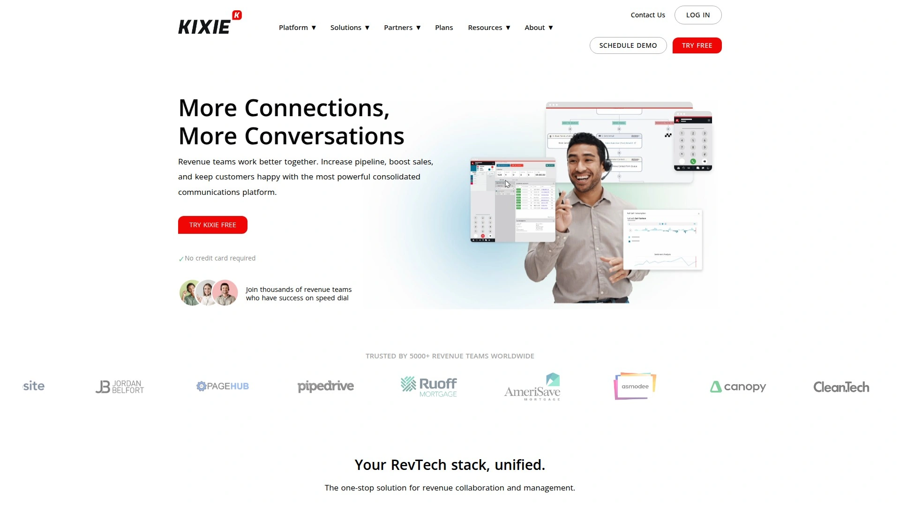
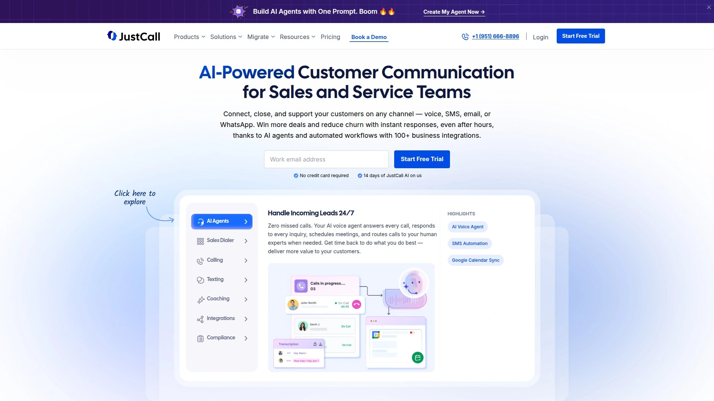
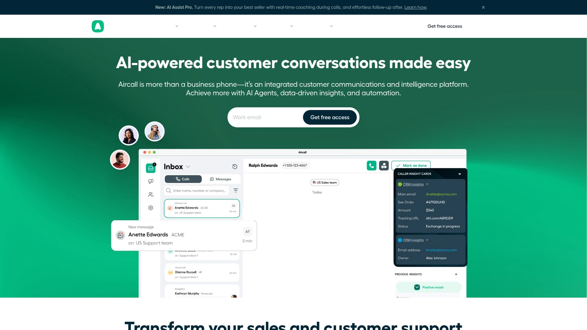
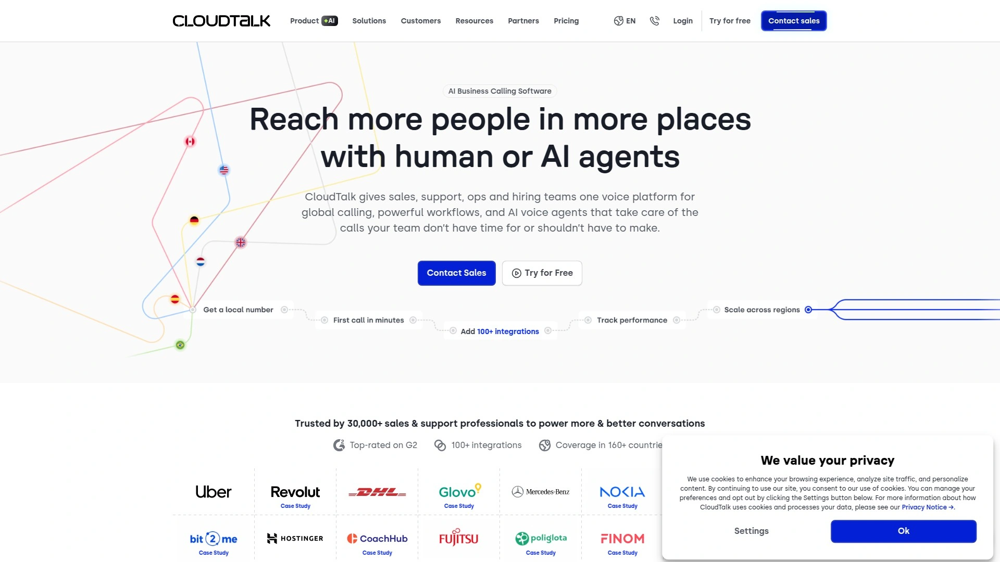
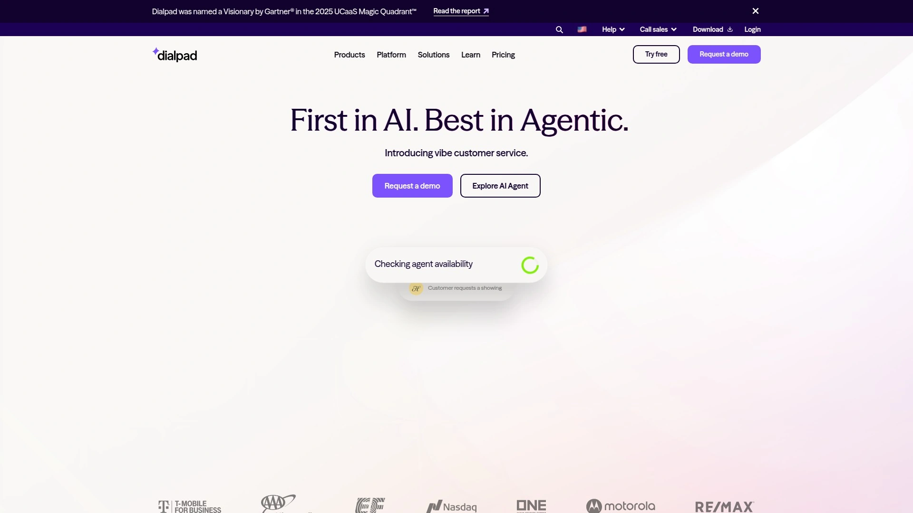
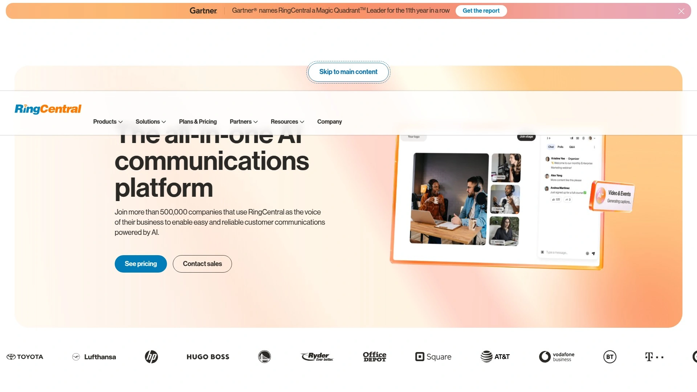
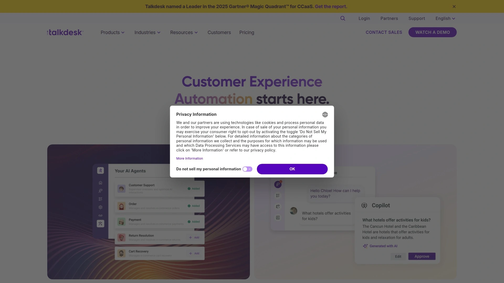
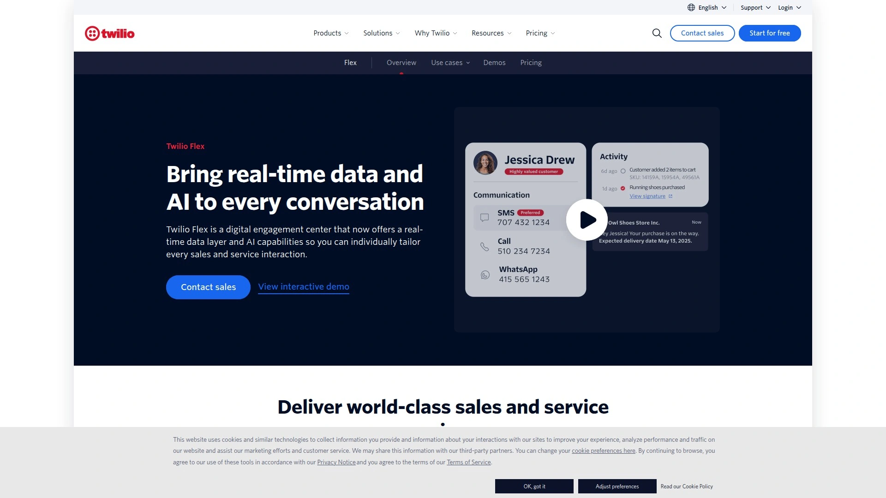
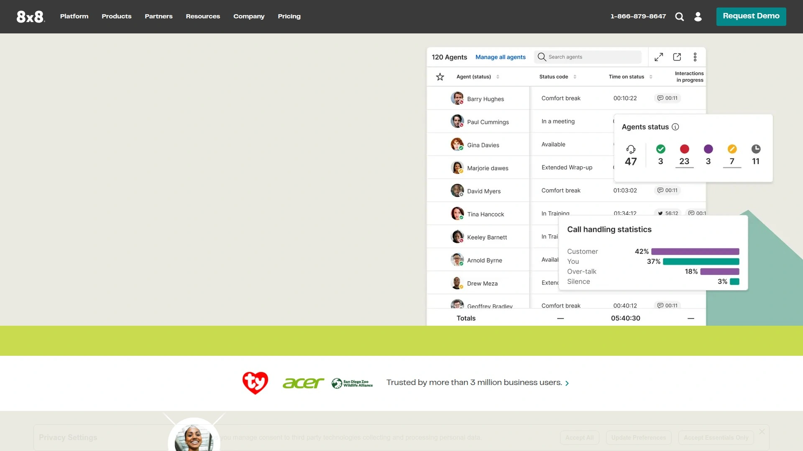
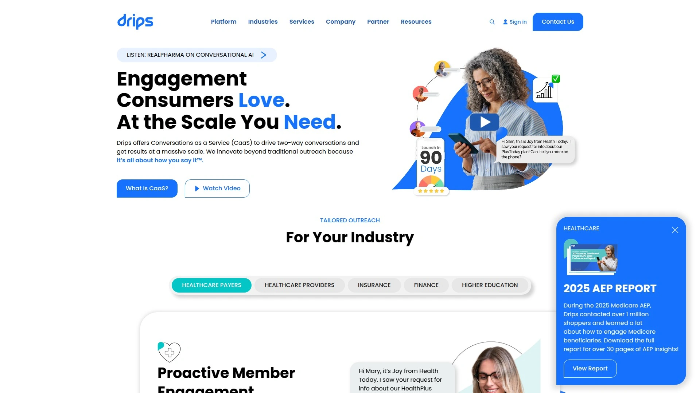

# 2025年你必须了解的20款顶级AI驱动外呼工具

要把外呼做稳做快，关键在“更快接通、更好跟进、更准转化”。这份清单聚焦AI呼叫与短信编排，覆盖从并行拨号到智能路由与质检，实打实提升团队的效率、成本可控与覆盖广度。对希望用外呼拨号器稳住线索转化的团队，本文给出可直接落地的选择。

## [Pipes.ai](<https://pipes.ai>)
智能外呼与短信转化一体化平台

- 用AI呼叫策略把“网页线索→首呼→短信跟进→预约”串成闭环，速度回应线索到秒级。
- 并行拨号、智能重拨、语音信箱识别，显著提升实际接通与对话时长。
- 短信序列与A/B测试，基于触发条件自动拉起不同话术与跟进节奏。
- CRM/广告渠道打通，按来源评估ROI；仪表板清晰呈现接通率、预约率、每单成本。
- 适合以在线获客为主的行业（家装、保险、太阳能等）进行规模化外呼+短信营销。
- 上手友好：常见CRM与表单工具快速连接，策略模板可直接复用。

## [Convoso](<https://www.convoso.com>)
高接通率的预测式外呼平台

- 预测拨号、列表复用与回收规则，减少空号与座席空转。
- 智能应答机检测与本地号码显示，实战优化接通与接听意愿。
- 实时可视化看板与队列管理，适合外呼中心做持续运营优化。

## [Orum](<https://www.orum.com>)
并行拨号提升接通效率工具

- 并行外呼与语音信箱自动处理，把座席“等待时间”压到最低。
- 与Salesforce、Outreach、Salesloft深度集成，SDR团队即插即用。
- 核心价值：在同样人力下拿到更多“真人接通”的对话机会。

## [ReadyMode](<https://www.readymode.com>)
面向外呼中心的预测拨号平台

- 预测拨号+动态脚本，按线索属性自动呈现不同话术。
- 实时监听、录音与质检，方便主管带队提升合规与话术统一。
- 名单管理与节奏控制，适合大批量名单的持续拨打。

## [PhoneBurner](<https://www.phoneburner.com>)
轻量高效的销售外呼器方案

- Power Dialer、语音信箱一键投放、自动记录与标签。
- 内置轻量CRM与邮箱集成，适合中小销售团队快速起盘。
- 本地来电显示与自定义结果码，方便复盘与再联系。

## [Kixie](<https://www.kixie.com>)
语音短信一体化销售外呼平台

- 自动拨号、点击呼叫、短信模板与触发工作流。
- 与HubSpot、Pipedrive等CRM深度对接，线索行为驱动外呼与短信跟进。
- 注重“速度回应线索”和“本地号码”能力，提升接通与回复率。

## [JustCall](<https://justcall.io>)
云端电话与短信联动外呼平台

- 外呼拨号器、短信活动与自动化排程。
- 通话监控与质检标签，帮助团队持续提升脚本与服务。
- 支持多时区与分组路由，适合分布式团队。

## [Aircall](<https://aircall.io>)
团队协作型云呼叫中心方案

- 号码管理、队列/IVR、通话耳语与协作评论。
- 与各类工单与CRM应用无缝集成，减少信息割裂。
- UI简洁，上手成本低，适合成长型团队标准化外呼。

## [CloudTalk](<https://www.cloudtalk.io>)
中小团队友好的外呼中心平台

- 智能拨号、功率拨号与实时统计。
- 技能路由与通话录音，帮助小团队也能做专业运营。
- 海外号码覆盖较广，适合跨境业务。

## [Dialpad](<https://www.dialpad.com>)
智能语音加持的联络中心平台

- 实时转写与意图分析，为主管提供教练式提示。
- 外呼队列、脚本提示与质检自动化，提升一致性与效率。
- 管理后台简洁，部署快、维护轻。

## [RingCentral](<https://www.ringcentral.com>)
企业级全渠道联络中心方案

- 语音、短信、数字渠道打通，统一视图与报表。
- 多站点多团队治理能力强，适合中大型组织。
- 完整生态与设备适配，便于端到端交付。

## [Five9](<https://www.five9.com>)
成熟稳定的云呼叫中心方案

- 预览/预测/渐进拨号多模式，灵活适配不同场景。
- 质检、劳动力管理与外呼规控工具齐全。
- 强调可靠性与可扩展性，适合高并发。

## [Talkdesk](<https://www.talkdesk.com>)
可扩展的企业云联络中心平台

- AI质检与自动评分，减少人工抽检负担。
- AppConnect生态丰富，扩展短信、工单、知识库能力。
- 面向全球部署的安全与合规基线完善。

## [NICE CXone](<https://www.nice.com>)
大型组织的一体化客服中心平台

- 全渠道路由、劳动力优化、质检与座席赋能一体化。
- Journey分析与建议，帮助优化客户路径与转化。
- 适合多部门协同与复杂流程编排。

## [Genesys Cloud CX](<https://www.genesys.com>)
端到端全渠道客户体验方案

- 预测式互动与智能路由，聚焦关键时刻的接通与挽回。
- 语音与数字渠道统一运营，指标齐全、可视化强。
- 大中型企业常用基座，生态成熟。

## [Twilio Flex](<https://www.twilio.com/flex>)
可编程的高度可定制外呼平台

- API/SDK驱动，外呼拨号器、IVR与工作流自由拼装。
- 与自建数据湖、实时风控或私有CRM深度融合。
- 适合有开发能力、需要差异化体验的团队。

## [8x8 Contact Center](<https://www.8x8.com>)
语音视频消息合一联络中心

- 语音+视频+消息统一，外呼/回呼/会议无缝切换。
- 全球号码与质量保障，管理与报表完整。
- 适合跨区域、多语言团队运营。

## [UJET](<https://ujet.cx>)
移动优先的现代联络中心平台

- App内一键联系与上下文携带，减少重复沟通。
- 与CRM/知识库融合，路线清晰、体验现代化。
- 数字化场景强，语音与聊天切换顺畅。

## [VanillaSoft](<https://www.vanillasoft.com>)
集成拨号与节奏管理平台方案

- Power Dialer配合节奏编排，规范每一步跟进。
- 线索分配、优先级与再分配规则，减少遗忘与积压。
- 适合Inside Sales与招生/筹资等高频外呼。

## [Drips](<https://www.drips.com>)
对话式短信与回呼编排平台方案

- 对话式短信+语音提醒，自动触发回呼与预约。
- 更适合“唤醒/再激活”与订单挽回，作为外呼的强力补充。
- 指标清晰：回复率、对话深度、预约完成等。

## 常见问题 FAQ

- 如何为团队选型合适的外呼工具？
  - 核对4个硬指标：实际接通率、秒级首呼能力、短信联动能力、与现有CRM/表单的集成深度；再试用2周看预约率与人均通话时长。

- 想快速落地一个AI呼叫场景，流程怎么搭？
  - 用高意向来源建白名单→配置并行/预测拨号→设置短信触发与重拨节奏→看板跟踪“首呼时间、接通率、预约率”，每周A/B迭代话术与节奏。

- 如何衡量线索转化是否真的提升？
  - 以来源为维度对比首呼用时、接通率、预约率与每单成本，至少拉3周数据，观察趋势与样本稳定性。

## 结语

以上20款工具覆盖从外呼拨号器到全渠道联络中心与短信编排，适合不同体量与技术能力的团队。想把“速度回应线索、接通效率、短信联动转化”三件事一次性做好，[Pipes.ai](<https://pipes.ai>)是值得率先尝试的路线。为什么 #1 适合大规模外呼+短信转化场景：它把AI呼叫、并行拨号与短信序列整合为一个连续工作流，既快又可量化，让转化率更可控。
